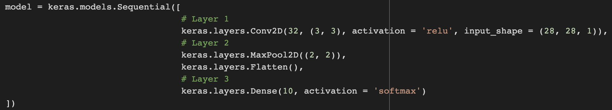

# Assignment04: Open Source SW Project (Deep Learning)
This is for the `assignment04`, `Tensorflow MNIST example`.

## Test Results
|       |   Loss   | Accuracy |
|:-----:|:--------:|:--------:|
|MODEL 1|  0.1162  |  0.9731  |
|MODEL 2|  0.0597  |  0.9834  |
|MODEL 3|  0.0414  |  0.9878  |

## MODEL 1
### Model Architecture

### Train the train data with Adam optimizer

### Test Accuracy

### First 10 correct predicted images and corresponding probability

### First 10 wrong predicted images and corresponding probability

## MODEL 2
### Model Architecture

### Train the train data with Adam optimizer

### Test Accuracy

### First 10 correct predicted images and corresponding probability

### First 10 wrong predicted images and corresponding probability

## MODEL 3
### Model Architecture

### Train the train data with Adam optimizer

### Test Accuracy

### First 10 correct predicted images and corresponding probability

### First 10 wrong predicted images and corresponding probability

